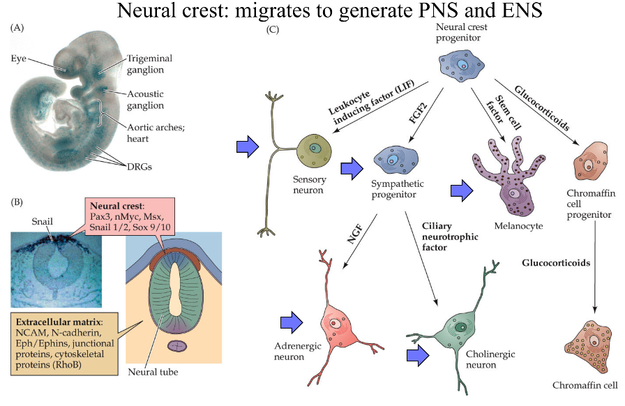
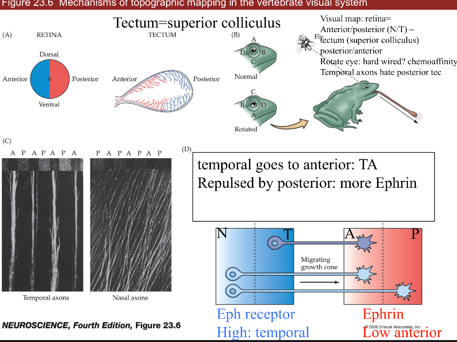
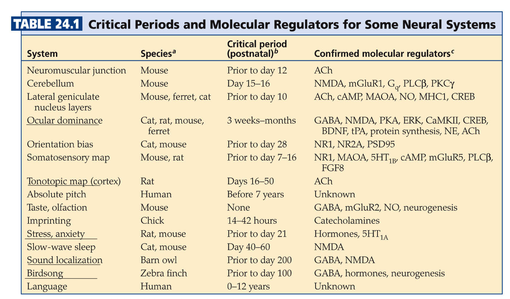
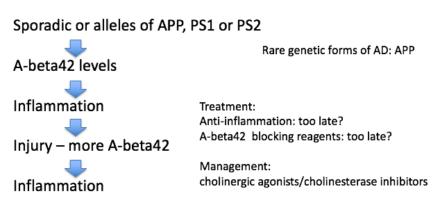

{:toc}

notes from Neuroscience, 5th edition + Intro to neurobiology course at UVA

# 22 early development
- ways to study
	1. top-down: rosy retrospection
	2. bottom-up: e.g. LTP/LTD
	3. human disease: stroke-by-stroke
	4. development=*ontogeny*
- timeframe
	- month 1 - gastrulation
		- most sensitive time for mom
	- month 2-5 - cells being born
	- up to year 2 - axon guidance / synapse formation
1. *gastrulation* - process by which early embryo undergoes folds = shapes of NS
	- diseases
		- *spina bifida* - neural tube fails to seal
			- vitamin B12 can fix this
		- *anencephaly* - neural tube fails to close higher up
	- parts
		1. *roofplate* at top (back)
		2. *floorplate* on bottom (stomach)
		3. *neural crest* - pinches off top of roofplate
2. *neuroblasts* = classic stem cells
	- assymetric division - cells generate themselves and differentiated progeny
	- ultimate stem cell - fertilized eggs
3. *differentiation*
	- cells made by neuroblasts decide what they are going to become
	- *morphogens*
		- *BMP* - roofplate
			- *cyclopia* - fatal defect in BMP
		- *Hedge hogs* - at floor plate
		- *Retinoids* - axial, affect skin
			- affected by *thalidomide* - helps morning sickness but causes missing limb segments
			- also affected by *accutane*
		- *FGFs* - axial symmetry
		- *Wnts* - skin, gut, hair
			- loss of wnts is loss of hair
	- floor plate loses function after embryogenesis except glioblastoma
	- measure BMP and HH gradient to figure out where you are
		- treat ALS by adding HH to make more alpha motor neurons
	1. dorsal direction
		- roofplate makes BMP
		- low HH - interneurons, sensory neurons (ex. nociceptors)
		- even BMP/HH - sympathetic
		- high HH - more motor neurons
		- *floorplate* makes HH (hedge hog)
	2. axial specification (anterior/posterior)
		- tube swells into bulbs that become cerebellum, superior colliculus, cortex
	- *homeotic genes* = *hox genes* - set of genes (transcription factors) in order on chromosome
		- order corresponds to order of your body parts
		- *rhombomeres* - segments in brainstem made by hox gene patterns
4. *lineages*
	- when neuroblast is born, starts producing progeny (family tree of neuron types)
	- very often, cells are produced in certain order
	- timing: cell-cell interations and tyrosine kinases determine order
	- first alpha neurons, then GABAergic to control those, last is glia
	- neural crest function
		- migratory - moves out and divides: 
		- *neuroblastoma* - developed early - severe problem because missing parts of NS
		- makes DRG and associated glial cells (schwann cells)
		- makes sympathetic NS and target ganglia, enteric NS, parasympathetic NS targets
		- makes *melanocytes* - know how to migrate and divide but can make *melanoma* (cancer)
	- cortex is made inside out (6->1)
		- starts with stem cells called *radial glia*
		- *cortical dysplasia* - missing a layer / duplicating a layer
			- small part with 2 layer 3s - severe epilepsy
5. *cell death*
	
	- 1/2 of cells die in development
6. *axon guidance* (ch 23)
	- each cell born and axon grows and are guided to a target
	- dendrite basically follows same rules
7. *synapse formation* (ch 23, 24)
	- pruning and plasticity
	- NMDA receptor type
	- form synapses and if they don’t look right - get rid of them
	- K1/K-1 synapses breaking and forming 
	- after age 21, K-1 starts increasing and net loss of synapses

# 23 circuit formation
- *growth cone* - motile tip of axon
	- *actin* tip
		1. *lamellipodium* - sheet (hand)
		2. *filopodium* - huge curves (fingers)
			- chemo attraction (actin assembly) and chemo repulsion (actin disassembly)
	- microtubule shaft - *tubulin* is much more cemented in
	- *mauthner cell* of tadpole - first recorded growth cone
	- can't regrow (that's why we can't regrow spinal cord)
- signals in growing axons
	1. *pioneer axons* (Betz cells) are first - often die
	2. *follower axons* (other Betz cells) can jump onto these and connect before pioneer dies
	- *trophic support* - neuron survives on contact
- frog *tectum* (has superior colliculus) with map of retina: 
	- *ephrin* (EPH) repulses axon
		- retinal NT -> tectum AP
		- axons have different amount of EPH receptors (in retina temporal has more than nasal)
		- gradient of EPH (in tectum anterior has less than posterior)
		- if we flip eye upside down (on nasal-temporal axis), image will be upside down
- 3 classes of axon guidance molecules: 
	1. *ECM/integrins*
	2. *NCAM* (homophilic—binds to another neuron that is NCAM),
		- follower neurons bind to pioneer through NCAM-NCAM interactions
	3. *Cadherin* (homophilic)
		- involved in recognition of being some place
- 4 important ligands/receptors
	1. *ephrins/eph*
		- gradient of eph receptor
	2. *netrin/dcc* = guidance moleculereceptor = DCC
		- attracts axons to floorplate (midline)
		- cells without DCC don't cross midline
	3. *slit/robo* - receptor is slit
		- chases axons off (away from midline)
		- axons not destined to cross midline are born expressing robo
		- axons destined to cross the midline only express robo after crossing
		- if DCC (-) and robo (-) will continue wandering around
		- *robo 4* is associated with Tourette's
	4. *semaphorins/plexins*
	- combinatorial code - use combinations of these to guide axons
	- these are the same genes that move cancer around
- synaptic formation
	- *neuroexins* - further recognition
		- turn up in autism and schizophrenia
	- *DSCAM*
		- associated with Down's syndrome
		- doesn't use gradients
		- makes different kinds of proteins by differential slicing
- competition
	- *neurotrophins* are secreted by muscle
		- in early development, a muscle fiber has many alpha motor neurons innervating it
		- all innervating neurons suck up neurotrophin and whichever sucks up most, kills all the others
		- eventually, each muscle fiber is innervated by one alpha motor neuron
		- only enough neurotrophin in target cells for a certain number of synapses
	- happens everywhere
		- ex. sympathetic ganglia
		- ex. sensory neurons in skin get axons to correct cell types based on neurotrophin
			- merkel - **BDNF**
			- proprioceptor - *NT3*
			- nociceptor - *NGF*
		- ex. muscles - produce NGF
			- treating ALS with NGF hyperactivates sensory neurons with trkA -> causes chicken pox
	- signals/receptors
		1. NGF - *trk a* (*Trk receptor* - survival signaling pathways)
		2. BDNF - *trk b*
		3. NT3 - trk b and *c*
		4. NT4/5 - trk b
		- all bind *p75* (death receptor)
		- want to keep neurotrophins local, because there aren't that many of them

# 24 plasticity in systems
- experience-dependent plasticity - 
	- ex. ducks imprinting is non-reversable
	- learning is crystallized during *critical period*
		- *CREB* and protein synthesis
		- *NMDA* receptors
		- *epigenetics* - histones control transcription and other things
	- follow *Hebb's postulate* - fire together, wire together
		- different eyes firing together will sync up (NMDA receptors to strengthen synapses)
- systems
	1. *ocular dominance*
		- left/right neurons terminate in adjacent zones
		- LGN in cortex uses efferents just like superior colliculus
		- label injected into retina can make it into cortex
		- cat experiments
			- some cells see only one eye, some see both
			- cats need to form visual map in short critical period (<6 days)
			- this is why you need cochlear implant early
			- both eyes open - equal OD columns
				- one eye closed - unequal OD columns
				- branches coming out of LGN neurons grow more branches based on relative light exposure (they compete for eye's real estate)
		- *strabismus* = lazy eye - poor coordination with one of the muscles
			- one eye is not quite seeing
			 - treat with patch on good eye -> allows bad eye to catch up since eyes compete for ocular dominance columns
			- more stimulus = more branches
		- dye from retina goes through thalamus into cortex
			- rabies virus does same thing: cell->ganglion->brain
	2. *tonotopic map*
		- connection between MSO and inferior/superior colliculus
		- playing one tone increases representation
		- playing white noise disorganizes map
		- *birdsong*
			- hear song 10-20 times when young - crystallized
			- afterwards can't learn new skills
	3. *stress* 
		- early stress sets stress points later in life
		- uses serotonin
- shifts
	- *superior colliculus* - integrate visual, auditory, motor to get X,Y coordinate
	- auditory map - plastic (but only when young)
	- visual map - not plastic
	- if you shift visual map (with a prism), auditory map can shift over to meet the visual
	- *optic neuritis* - ms optic nerve disease that shifts map
	- only young animals can shift unless they were shifted before and are now unadapting

# 25 repair and regeneration
1. full repair - human *PNS* - skin, muscles
	- 1-2 mm/day growth - speed of slow axonal transport
	- thinnest axons first (thermal receptors and nociceptors)
	- proprioceptors last
	- process
		- *perinerium* / *schwann cells* surrounds axons - helps regeneration
		- growth cones that are cut form stumps -> distal axons degenerate = *walerian degeneration*
		- macrophages come in and eat up the damaged stuff
		- neurotrophins are involved
	- miswiring is common - regrow and may not find right target
		- *bell's palsy* - loss of facial nerve - recovers with miswiring (salivary / tear)
	- *neuromuscular junctions* (NMJ)
		- damaged cells leave *synaptic ghost* = glia and protein matrix for nerve to regrow into
		- repairs easily after heavy training
2. no repair / glial scar - human *CNS*
	- no ghost because so spread out
	- glia cover wound (scar) but can't develop further
	- has *astrocytes* and *oligodendrocytes* (types of glial cells)
		- don't support regrowth
		- involved in scarring
	- *microglia* - from immune system
		- control inflammation
		- release cytokines
	- *nogo* - protein that blocks regrowth (but there are other proteins as well)
	- we try repairing with *shunts* - piece of sciatic nerve from other part of body with schwann cells from PNS to try to repair a connection in the CNS
3. stem cell regeneration - put new neurons being formed, 2 places in humans
	- non-human examples
		- floor plate of lizards can make new tail
		- fish retina always making new cells
		- canary brain part has stem cells that learn new song every year
	- small C14 incorporation after early development
			- suggests we don't regenerate neurons
			- C14 was from nuclear testing
	- human areas that do regenerate
		1. *hippocampus*
			- memories you store temporarily
		2. *subventricular zone* makes *glomeruli* in *olfactory bulb* cells
			- turnover daily
			- sensory neurons and their targets constantly die and regenerate
		3. *niche* - places where stem cells stay alive
			- ex. places in CNS with WINT molecular signals
- damage control - remove these signals for *apoptosis* = cell death
	- *glutamate increase* - excitotoxicity
		- can stop with *NMDA blockers*
		- induce a coma by cooling them down or *GABA drugs*
	- *cytokines increase* - immune system (like neurotrophins), inflammation
	- *hypoxia/stress*
	- *neurotrophin withdrawal*
		- in stress times neurotrophin goes down

# 26 diseases
## alzheimer's
- 
- overview
	- age-associated - tons of people get it
	- doesn't kill you, secondary complications like pneumonia will kill you
	- rate is going up
	- very expensive to treat
- *declarative* memories are affected by Alzheimer's
	- these are memories that you know
- first 2 areas to go in Alzheimer's
	1. *hippocampus*
		- patient HM had no hippocampus
			- no *anterograde* memory - learning new things
		- hippocampus stores 1 day of info
			- offloading occurs during sleep (REM sleep) to prefrontal cortex, temporal lobe, V4
			- dreaming - might see images as you are offloading
	2. *basal forebrain* - spread synapses all over cortex
		- uses *Ach*
		- ignition key for entire cortex
- alzheimer's characteristics only found in autopsy
	- *amyloid plaques*
		- maybe *A-beta* causes it
		- A-beta comes from *APP*
		- *A-beta42* binds to itself 
			- prion (starts making more of itself)
			- this cycle could be exacerbated by injury
			- clumps and attracts immune system which kills local important cells
				- this could cause Alzheimer's
			- rare genetic mutations in A-beta increase probability you get Alzheimer's
			- anti-inflammation may be too late
			- can take drugs that increase Ach functions - ex. cholinergic agonists, cholinesterase inhibitors
	- *tangles*
		- tangles made of protein called *Tau*
	- most people think these are just dead cells resulting from Alzheimer's but some think they cause it

## parkinson's
- loss of substantia nigra pars compacta dopaminergic neurons
	- when you get down to 20% what you were born with
	- dopaminergic neurons form *melanin* = dark color
	- hits to head can give inflammation
- know what they need to do - don't have enough dopamine to act
- treat with L Dopa -> something like dopamine -> take out globus pallidus
- *Lewy bodies* are clumps of *alpha synuclein* - appear at dopaminergic synapses
	- clumps like A-beta42
	- associated with early-onset Parkinson's (rare) associated with genetic mutations
- *bradykinesia* - slowness of movement
- age can give parksinson's
- no evidence that toxins can induce parkinsons
- *PTP/ pesticides* can induce Parkinson's in test animals
- 1/500 people